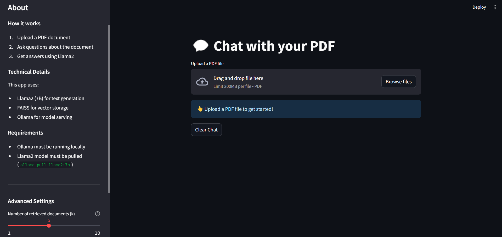

# LLaMA2 PDF Assistant

A powerful PDF analysis tool powered by LLaMA2 that can read, understand, and answer questions about PDF documents. This project leverages advanced language models and RAG (Retrieval Augmented Generation) to provide intelligent document analysis and natural language interactions.



## Key Benefits

- **Data Privacy**: All operations happen locally - your data never leaves your machine
- **Cost Efficiency**: No expensive API subscriptions needed - free and open-source solution
- **Customizability**: Flexible architecture allows fine-tuning of document retrieval and response generation
- **Powerful AI**: Integrated with LLaMA2 for advanced reasoning and technical tasks

## Features

- PDF document analysis and understanding using state-of-the-art language models
- Natural language question answering with context-aware responses
- Interactive chat interface using Streamlit for seamless user experience
- Powered by LLaMA2 for advanced language understanding and generation
- Support for various document types and complex queries
- Vector-based document retrieval for accurate information extraction
- Real-time processing and response generation

## Example Use Cases

### 1. Resume Analysis
As shown in the example above, the system can:
- Extract and understand educational qualifications
- Analyze technical skills and experience
- Comprehend project details and achievements
- Process complex technical information about various technologies
- Provide concise summaries of professional experience


### 2. Document Question-Answering
- Ask specific questions about document content
- Get contextual answers based on document information
- Extract key information from lengthy documents
- Understand relationships between different parts of the document

### 3. Additional Applications
- **Finance**: Analyze financial reports and extract actionable insights
- **Healthcare**: Summarize research papers or medical guidelines
- **Education**: Extract summaries or key points from e-books and academic papers

## Technical Stack

- **Frontend**: 
  - Streamlit for interactive web interface
  - Streamlit-chat for conversational UI

- **Backend**:
  - LLaMA2 via Ollama for natural language processing
  - LangChain for orchestrating the document processing pipeline
  - PyPDF for PDF document parsing
  - FAISS for vector storage and retrieval
  - Sentence Transformers for text embeddings

## Installation

1. Clone the repository:
```bash
git clone https://github.com/sharmadishant04/llama2-pdf-assistant.git
cd llama2-pdf-assistant
```

2. Create a virtual environment:
```bash
python -m venv venv
source venv/bin/activate  # On Windows: .\venv\Scripts\activate
```

3. Install dependencies:
```bash
pip install -r requirements.txt
```

4. Install Ollama and download the LLaMA2 model and run it locally:
```bash
# Follow Ollama installation instructions from: https://ollama.ai/
ollama pull llama2
```

## Usage

1. Start the Streamlit application:
```bash
streamlit run app.py
```

2. Upload your PDF document through the web interface

3. Ask questions about the document content in natural language

4. Receive detailed, context-aware responses based on the document content

## How It Works

1. **Document Processing**:
   - PDF documents are loaded and split into manageable chunks using LangChain's PyPDFLoader
   - Text is processed and converted into embeddings
   - Embeddings are stored in FAISS for efficient retrieval

2. **Query Processing**:
   - User questions are analyzed and converted to embeddings
   - Relevant document chunks are retrieved using similarity search
   - Context is assembled from the most relevant chunks

3. **Response Generation**:
   - LLaMA2 generates natural language responses based on retrieved context
   - Responses are formatted and presented through the chat interface

## Customization Options

You can fine-tune the retrieval settings for optimal performance:

- **Number of Retrieved Results (k)**:
  - Controls how many document chunks are used in the response
  - Higher k: More context, slower response
  - Lower k: Less context, faster response

- **Similarity Score Threshold**:
  - Filters retrieved results based on relevance
  - Higher threshold: Only highly relevant chunks are retrieved
  - Lower threshold: Broader context but less precise

## Dependencies

- streamlit==1.32.0
- langchain>=0.1.0
- langchain-community>=0.0.38
- streamlit-chat==0.1.1
- pypdf==4.1.0
- faiss-cpu>=1.7.4
- sentence-transformers==2.5.1
- python-dotenv==1.0.1
- ollama>=0.1.6